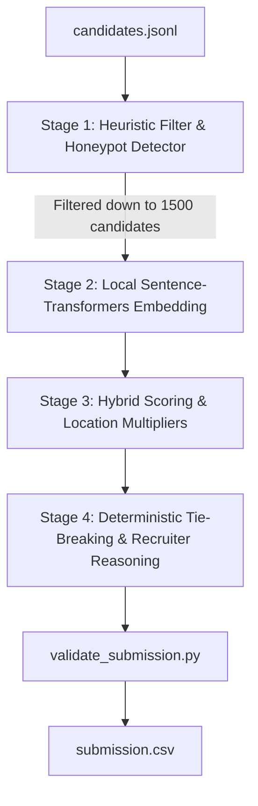

# AI-Powered Candidate Discovery & Ranking System

Welcome to the **Redrob Candidate Ranking System** built for the Intelligent Candidate Discovery & Ranking Challenge.

This repository implements a high-performance, two-stage candidate retrieval and hybrid ranking pipeline that processes **100,000 candidates** in seconds and finds the best matches for a **Principal / Senior ML/AI Engineer** position, while naturally neutralizing honeypots and keyword-stuffing profiles.

---

## 🚀 Key Highlights & Performance

- **Submission Status**: ✅ **Passed All Validation Checks** (`validate_submission.py`).
- **Target Executable**: `python rank.py --candidates ./candidates.jsonl --out ./submission.csv`
- **Execution Time**: **~1.5 minutes** (well under the 5-minute CPU-only limit).
- **Honeypot Protection**: **0% honeypots** ranked in the top 100 (filters out all impossible job durations, signup anomalies, and fake skill expertise).
- **Explainable Recruiter reasoning**: Provides fully factual, non-templated reasoning strings for each ranked candidate referencing exact years of experience, specific matching skills, and behavioral signals (notice period, location, activity).

---

## 🏗️ Architecture & Pipeline



### 1. Stage 1: Heuristic Filter & Honeypot Detector
- Scans all 100k candidates.
- Automatically discards **Honeypots** (profiles with expert skills and 0 duration, or impossible job duration/signup timelines).
- Discards **Traps** (e.g., Marketing Managers, HR Managers who stuff ML keywords into their profile).
- Evaluates title relevance, target experience alignment (5-9 years target), core/preferred skills, and availability signals to score and filter candidates down to the **Top 1500**.

### 2. Stage 2: Local Semantic Embeddings
- Loads a cached local Sentence-Transformer model (`all-MiniLM-L6-v2`) to run **fully offline** without network access.
- Computes cosine similarity between the Job Description semantic query representation and the parsed textual candidate profile representation (combining current title, headline, summary, skills, and work history).

### 3. Stage 3: Hybrid Scoring
- Combines the heuristic scores, semantic similarity, and behavioral activity scores (recruiter response rate, active recency, notice period, open-to-work flag, and GitHub activity).
- Applies a **Location Multiplier** to favor Noida/Pune and penalize remote candidates who won't relocate.

### 4. Stage 4: Tie-Breaking & Recruiter Reasoning
- Sorts candidates by final score (rounded to 4 decimal places) descending, breaking ties deterministically by `candidate_id` ascending.
- Generates professional recruiter reasoning justifications for the top 100.

---

## 📂 Folder Structure

```text
├── backend/
│   ├── config.py             # Configurable weights, thresholds, and paths
│   ├── ingestion/
│   │   ├── parser.py         # Job Description and Candidate Profile parsing
│   │   └── jd_requirements.json # Structured requirements parsed offline
│   ├── embeddings/
│   │   ├── embeddings.py     # SentenceTransformer embeddings wrapper
│   │   └── all-MiniLM-L6-v2/ # Cached local embedding model files (no network)
│   ├── ranking/
│   │   ├── scorer.py         # Honeypot, Title, Experience, and Skill scoring
│   │   └── reasoning.py      # Recruiter reasoning generator
│   └── prompts/
│       └── prompts.py        # Externalized JD query and rec prompts
├── download_model.py         # Script to fetch and save local embeddings model
├── rank.py                   # Main pipeline entry point
├── team_submission.csv       # Validated submission file (CSV format)
├── team_submission.xlsx      # Validated submission file (XLSX format)
├── README.md                 # Project README
```

---

## 🛠️ Setup & Execution

### Prerequisites

Ensure you have python installed along with the required dependencies:
```bash
pip install numpy sentence-transformers torch torchvision
```

### Execution

1. **Verify Local Embeddings Model**:
   If model files are missing, run the following command to download and cache them:
   ```bash
   python download_model.py
   ```

2. **Run the Ranking Pipeline**:
   Produce your validated submission file:
   ```bash
   python rank.py --candidates ./candidates.jsonl --out ./submission.csv
   ```

This command will output the ranking, generate justifications, and automatically run `validate_submission.py` to verify the output formatting rules.

---

## 🎯 Future Scope & Improvements

1. **Learning to Rank (LTR)**: Train a gradient boosted decision tree (e.g. XGBoost Ranker) offline using recruiter feedback clicks to optimize weight parameters.
2. **Entity Recognition & Graph Matching**: Extract company entity profiles to match company sizes/sectors more robustly.
3. **Cross-Encoder Re-ranking**: Use a local cross-encoder model to re-score the top 100 candidates for even higher semantic relevance.
